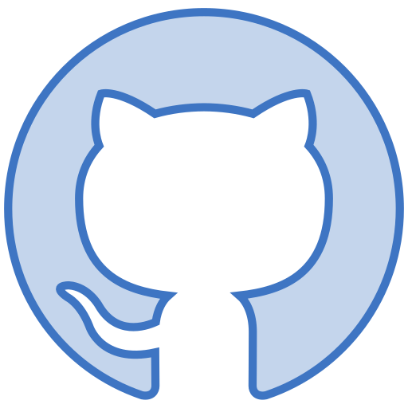

#  Built With


<br>

#  Introduction
Our mission is to simplify log management for our users. With our custom npm logging package that seamlessly integrates into your code, alongside the LogYard application, you can easily visualize and analyze logs using various graphs based on various timeframes and log types. Our platform also offers dynamic log filtering, allowing users to group logs as well as filter them based on their individual properties. These features aim to make log management a breeze - helping you to make monitoring and troubleshooting effortless. 

#  Features
- Logging Package
    - Our custom npm logging package enables you to record both your frontend and backend logs and have them stored safely in a local Docker/MongoDB database.
    - Logs have various customizable attributes:
        - Type ( Options: error, warn, info, http, verbose, debug, silly )
        - Message ( What message do you want to be displayed with this log? )
        - Context ( Allows you to assign relevant information to your log. Such as which file or container it came from. )
- Application
    - See your logs in real-time.
    - Sort and filter logs based on various properties.
    - Save custom filters to your account.
    - Visualize your logs through several graph types. Using log-type filtering and time selection, only visualize the logs your need.

#  How to Install

In order to start logging in your application and using LogYard's application, follow the steps below to install the proper dependencies.

## Frontend Logging
- Run `'npm install logyard'` in your command line.

## Backend Logging
- Run `'npm install logyardbackend'` in your command line.

## Application
- Ensure you have a DockerHub account and have Docker Desktop installed. 
- We will go into the steps of how to pull the Docker image in the 'How to Use' section.

Once the dependencies have been installed, follow the instructions in the 'How to Use' section to import and implement the logging functionality in your project, as well as how to use the LogYard application itself. 

For any inquiries about installation or usage, please feel free to contact the team at logyardOSP@gmail.com.

#  How to Use

Due to some interactions between the browser and ___ , we need to have two logging packages (one for the frontend and one for the backend) in order to reliably send, store and retrieve your logs.

## Logging
1. Start by navigating to the file that you would like to use the logger in. 
2. At the top of your file, import the appropriate logger using one of the following line of code: 
    - Frontend: `import logyard from 'logyard'`
    - Backend: `import logyard from 'logyard-be'`
3. Once the frontend logger has been imported, embed the 'logyard' function with the following argument options and by following the template below.
    - Arguments:
        - Error Type (Type: String) : 
            - 'error', 'warn', 'info', 'http', 'verbose', 'debug', or 'silly'.
        - Message (Type: String) : 
            - Any message you wish to be sent with the log.
        - Context(s) (Type: Object) :
            - Key-value pairs for each context you wish to include.
        ```env
            Template:
            logyard(
                [Error Type] , 
                [Message] , 
                { [ Context(s) ] } 
            );
            
            Example:
            logyard(
                'error', 
                'authController.setCookie failure', 
                { Location: controllers/authController }
            )
        ```

## Application
1. Navigate to the [LogYard repository](https://google.com) on DockerHub.
2. Fork and clone the repo.
3. Type the following command in your termindal to pull the LogYard image from the repository: 

    `'docker pull logyard/[repo-name???]'`

4. Open Docker Desktop and run the LogYard container.
5. Open localhost:8080 - the LogYard application should appear here!

#  Contributing
We hope you enjoy using our product and find it useful! 

If you have found a bug or an area that you feel could be improved within our product, please reach out - or if you'd like, you can create a fork on this repo and contribute to our product yourself! Contributions are vital to the open-source community and all contributions are greatly appreciated!

Following the completion of your outstanding work, if you create a PR, our team will review your code! We thank all of those who contribute toward improving our product's reliability and expanding upon it's features.

## Tasks for Contrubution
- [x] Be Awesome.
- [ ] Rebuild using Bun.io
- [ ] Some other things that are less important than Bun ...

#  Publications
- Link to various article(s) - Medium, etc.

#  Our Team
| [](https://www.linkedin.com/in/prestoncoldwell/) | [](https://www.linkedin.com/in/ryan-smithey/) | [](https://www.linkedin.com/in/geoffrey-sun/) | [](https://www.linkedin.com/in/andrewclarkwagner/) | [](https://www.linkedin.com/in/brianhwang2/) |
| ------------- | ------------- |------------- | ------------- | ------------- |
| <div style="text-align: center">Preston Coldwell</div>  <div style="text-align: center">[](https://github.com/PrestonColdwell) [](https://www.linkedin.com/in/prestoncoldwell/)</div> | <div style="text-align: center">Ryan Smithey</div>  <div style="text-align: center">[](https://github.com/RyanSmithey) [](https://www.linkedin.com/in/ryan-smithey/)</div> | <div style="text-align: center">Geoffrey Sun</div>  <div style="text-align: center">[](https://github.com/geoffsun2) [](https://www.linkedin.com/in/geoffrey-sun/)</div> | <div style="text-align: center">Andy Wagner</div>  <div style="text-align: center">[](https://github.com/a-c-wagner) [](https://www.linkedin.com/in/andrewclarkwagner/)</div> | <div style="text-align: center">Brian Hwang</div>  <div style="text-align: center">[](https://github.com/bri-engineer) [](https://www.linkedin.com/in/brianhwang2/)</div> |

#  Acknowledgments
- [OSLabs](https://github.com/open-source-labs)


#  Support Us
If our product has helped you, or you would just like to show your support, please ⭐️ this repository! It helps more than you know!