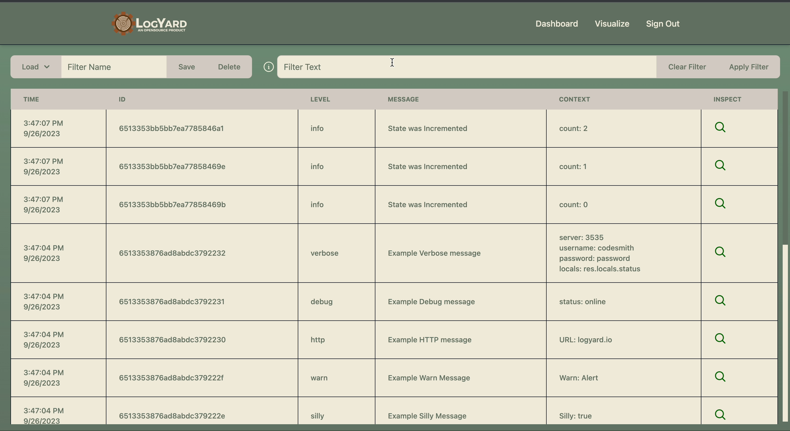

#  About

## Built With


<br>

## Introduction

Our mission is to simplify log management for our users. With our custom logging package implemented in your code, alongside the LogYard GUI, you can easily visualize and analyze logs using multiple, customizable graphs based on time and log types. Our platform also offers dynamic log filtering, allowing users to group logs as well as filter them based on their individual properties. These features aim to make log management a breeze - helping you monitor and troubleshoot effortlessly. 

## Features

- Logging Package

    - Our custom logging package allows you to record frontend and backend logs and to store them safely in a local Docker or MongoDB cloud database.
    - Logs have various customizable attributes:
        - Type ( Options: error, warn, info, http, verbose, debug, silly )
        - Message ( What message do you want to be displayed with this log? )
        - Context ( Allows you to assign relevant information to your log, such as which file or container it came from. )

- Application

    - See your logs in real time.
    - Sort and filter logs based on level and customizable properties.
    - Save custom filters to your account.
    - Visualize your logs through several graph types. Using log-type filtering and time selection, only visualize the logs you need.

#  Demo Our Product

We created a demo project for you to easily test our product's logging functionality and use our GUI. Follow the steps below in order to properly run the demo.

1. LogYard

    1. Ensure you have Docker Desktop installed and opened, and that you are signed in with your Docker account.

    2. Clone the LogYard repository using the following terminal command (you can visit the repo [here](https://github.com/oslabs-beta/LogYard)):

        `git clone https://github.com/oslabs-beta/LogYard.git`

    3. Open the LogYard repo that you just cloned in your terminal and enter the following command lines to properly create and run the Docker image.

        `docker build -t logyard .`

        `docker compose up`

    4. Open Docker Desktop and navigate to Containers.

    5. To open the LogYard application, click on the logyard app_container running on port '5555:5555'.

        

    6. You should now see LogYard's user sign-in page in your browser (shown below). To sign in as a guest, enter your server password located in your .env file (named 'VITE_USER_PASSWORD'). Or sign-up to have access to additional features, such as the ability to save custom log filters.
        

2. Demo App

    1. Navigate to our demo app's GitHub [repository](https://www.google.com/).

    2. Clone the LogYard demo app's repository using the following terminal command (you can visit the repo [here](https://github.com/OSP7/LogYard-Demo-App)):

        `git clone https://github.com/OSP7/LogYard-Demo-App.git`

    3. Within the demo app's directory, install package dependencies and run the app using the following terminal commands, in order:

        `npm install`

        `npm run dev`

        After following the above steps, the demo app should now be visible on localhost:0000 and the LogYard GUI should remain accessible through your Docker container.

    4. Interacting with the demo app will generate logs that can be seen in the LogYard GUI! Go ahead and give it a try - filter and visualize these logs!

        
        
    
        We hope you find our product useful. Once you're done, implement the logger package into your own application to view your own logs in our app! (see [below](#Use-Our-Product))

#  Use Our Product

In order to start logging in your application and using LogYard the LogYard GUI, follow the steps below to install the proper dependencies.

## 1. Logging Packages

### Installing packages

1. Navigate to the directory in which you would like to install our packages. This should be the root directory for your project.

2. In your terminal, type the following command to install the appropriate packages for frontend and backend logging capabilities.

    `npm install logyard logyardbackend`

### Using packages

1. Navigate to the specific file that you would like to use the logger in. 

2. At the top of your file, import the appropriate logger using one of the following line of code: 

    - For Frontend Logs: `import logyard from 'logyard'`

    - For Backend Logs: `import logyard from 'logyardbackend'`

3. Once the logger has been imported, embed the 'logyard' function with the following argument options and by following the template below.

    - Arguments:

        1. Error Type (Type: String) : 
            - 'error', 'warn', 'info', 'http', 'verbose', 'debug', or 'silly'.

        2. Message (Type: String) : 
            - Any message you wish to be sent with the log.

        3. Context(s) (Type: Object) :
            - Key-value pairs for each context you wish to include.

        ```JavaScript
            // Template:
            logyard(
                'errorType', 
                'message' , 
                { 
                    ContextOneKey : ContextOneValue, 
                    ContextTwoKey : ContextTwoValue,
                } 
            );
            /* or */
            logyardbackend(
                'errorType', 
                'message' , 
                { 
                    ContextOneKey : ContextOneValue, 
                    ContextTwoKey : ContextTwoValue,
                } 
            );
            
            // Example:
            logyard(
                'error', 
                'authController.setCookie failure', 
                { 
                    Location: 'controllers/authController', 
                    Server: 6,
                }
            )
        ```

## 2. Setting up .env file
1. Copy and paste the following code into your .env file.
    ```env
        VITE_USER_PASSWORD = password
        VITE_DB_URI = mongodb://mongodb:27017
        VITE_DB_DBNAME =  LogYard
    ```
2. Change .env variables to meet your preferences.
    - VITE_USER_PASSWORD - This is the 'server password' used on login.
    - VITE_DB_URI - Database URI that you'd like to connect to. You can put your own MongoDB URI here to have logs and other app information sent there.
    - VITE_DB_DBNAME - This must match 'dbName' in your config/default.json file.


## 3. Setting up .config file
1. In your project's root directory, create a new directory named 'config'.
2. Within this new 'config' directory, create a new file titled 'default.json'.
    ```
        my_project  
             └─── config
             │    └─── default.json
             └─── node_modules
             │
             └─── src
             │
             └─── server
             │
             other root files...
    ```
3. Copy and paste the following code into your newly created 'default.json' file.
    ```json
        {
            "uri": "mongodb://localhost:8000",
            "level": "silly",
            "dbName": "LogYard"
        }
    ```
4. Optional: Modify these 'default.json' variables to meet your needs.
    - uri: URI for which the front-end logger will connect to.
    - level: Level at which all logs and below will be collected and sent to the database and thus, to the LogYard GUI.  
    All logs collected at level 'silly'.
    - dbName: The name for which you would like your database to be saved under.

## 4. LogYard GUI

Note: If you have already installed the GUI from the demo, 

1. Ensure you have Docker Desktop installed and opened, and that you are signed in with your Docker account.

2. Clone the LogYard repository using the following terminal command (you can visit the repo [here](https://github.com/oslabs-beta/LogYard)):

    `git clone https://github.com/oslabs-beta/LogYard.git`

3. Open the LogYard repo that you just cloned in your terminal and enter the following command lines to properly create and run the Docker image.

    `docker build -t logyard .`

    `docker compose up`

4. Open Docker Desktop and navigate to Containers.

5. To open the LogYard application, click on the logyard app_container running on port '5555:5555'.

    

6. You should now see LogYard's user sign-in page in your browser (shown below). To sign in as a guest, enter your server password located in your .env file (named 'VITE_USER_PASSWORD'). Or sign-up to have access to additional features, such as the ability to save custom log filters.
    

7. Interacting with your app to invoke your logging functions will populate them in the LogYard application, allowing them to be analyzed, filtered, and visualized!

    
     

#  FAQ

1. Why do two seperate packages exist for logging?
    - A browser application cannot directly connect to a database. Therefore the frontend logger sends logs first to a server that is connected to your database. The backend logger directly connects to the database.

2. I can read my server logs why use this service?
    - LogYard provides a central location for accessing, reading, and analyzing logs. It is unnecessary for a single server but as an organization scales reading logs from more than 2-3 sources quickly becomes a time sink.

3. Will this work with my distributed compute cluster?
    - LogYard is designed to work with any compute service that can connect to a database.

4. Can I use this for state replication?
    - LogYard does not provide state replication. It is intended as a lightweight solution for active logging analysis not an all encompassing tool.

#  Contributing
We hope you enjoy using our product and find it useful! 

If you have found a bug or an area that you feel could be improved within our product, please reach out - or if you'd like, you can create a fork on this repo and contribute to our product yourself! Contributions are vital to the open-source community and all contributions are greatly appreciated!

Following the completion of your outstanding work, if you create a PR, our team will review your code! We thank all of those who contribute toward improving our product's reliability and expanding upon its features.

## Tasks for Contrubution
- [ ] Improving analysis tools. Current tools provide a simple interface but lack in depth capabilities.
- [ ] Additional account customization. 
    - Current accounts lack any organization features. Managing access to logs could be useful depending on application.
    - A more customizable dashboard and visualization page. Currently rather basic save, load, and delete is used for monitoring.
- [ ] More robust log displays. Currently all logs require a specific layout. A major improvement would be a single location to allow a drop in replacement for different log models.
- [ ] Improved C3 integrations. C3 is a powerful graphing tool however it directly effects the DOM unlike React which uses a virtual DOM. A major task would be to improve the current interface between C3 and React. Specifically more a more responsive layout for graphs allowing a more customizable visualization page.

#  Publications
- Medium.com Article (NEED TO LINK)

#  Our Team
| [](https://www.linkedin.com/in/prestoncoldwell/) | [](https://www.linkedin.com/in/ryan-smithey/) | [](https://www.linkedin.com/in/geoffrey-sun/) | [](https://www.linkedin.com/in/andrewclarkwagner/) | [](https://www.linkedin.com/in/brianhwang2/) |
| ------------- | ------------- |------------- | ------------- | ------------- |
| <div style="text-align: center">Preston Coldwell</div>  <div style="text-align: center">[](https://github.com/PrestonColdwell) [](https://www.linkedin.com/in/prestoncoldwell/)</div> | <div style="text-align: center">Ryan Smithey</div>  <div style="text-align: center">[](https://github.com/RyanSmithey) [](https://www.linkedin.com/in/ryan-smithey/)</div> | <div style="text-align: center">Geoffrey Sun</div>  <div style="text-align: center">[](https://github.com/geoffsun2) [](https://www.linkedin.com/in/geoffrey-sun/)</div> | <div style="text-align: center">Andy Wagner</div>  <div style="text-align: center">[](https://github.com/a-c-wagner) [](https://www.linkedin.com/in/andrewclarkwagner/)</div> | <div style="text-align: center">Brian Hwang</div>  <div style="text-align: center">[](https://github.com/bri-engineer) [](https://www.linkedin.com/in/brianhwang2/)</div> |

#  Acknowledgments
- [OSLabs](https://github.com/open-source-labs)


#  Support Us
If our product has helped you, or you would just like to show your support, please ⭐️ this repository! It helps more than you know!

<!-- level: USER DECLARED ( (0)error, (1)warn, (2)info, (3)http, (4)verbose, (5)debug, (6)silly ) -->
